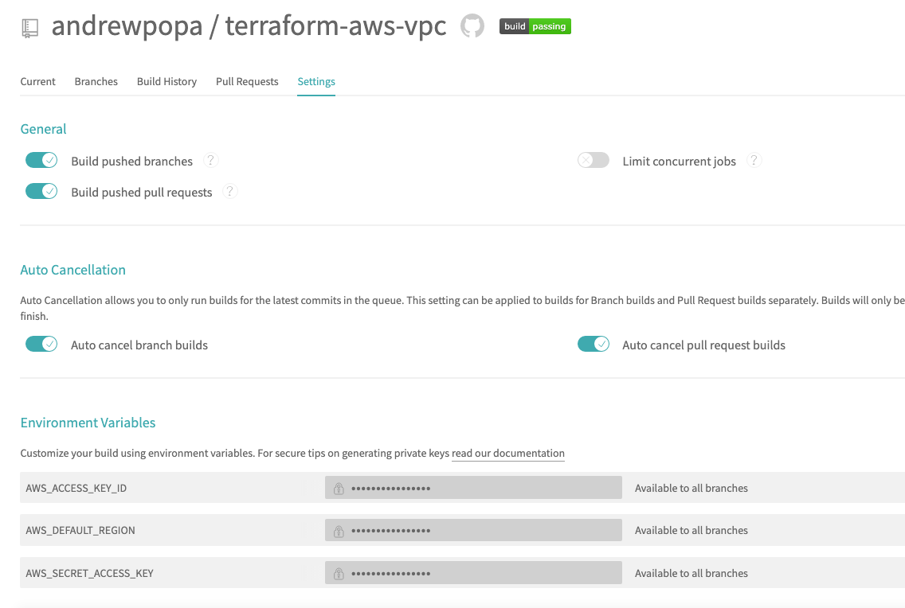

# terraform-aws-vpc
Terraform module with some minimal inputs to create VPC resources on AWS platform. 

<!--
| **Branch**  | **Build status** |
| ------------- | ------------- |
| master  | [](https://travis-ci.org/andrewpopa/terraform-aws-vpc)  |
-->

# Terraform version
This module was written and tested with Terraform v0.12.9 

# Assumptions
- You want to create VPC resourse on AWS which can be consumed but other resources which will be created inside this VPC
- You have access to AWS console where you can create you security credentials `AWS_ACCESS_KEY_ID` and `AWS_SECRET_ACCESS_KEY`
- You configured your security credentials as your environment variables `~/.bash_profile` 

```
export AWS_ACCESS_KEY_ID=XXXX
export AWS_SECRET_ACCESS_KEY=XXXX
export AWS_DEFAULT_REGION=XXXX
```

Module will use all availability zones with state `available` based on region which is configure as env variable `AWS_DEFAULT_REGION`.

# How to consume
- [`example`](https://github.com/andrewpopa/terraform-aws-vpc/tree/master/example) folder contain an example of how to consume the module


```terraform
module "vpc" {
  source = "../"

  # VPC
  cidr_block          = "172.16.0.0/16"
  vpc_public_subnets  = ["172.16.10.0/24", "172.16.11.0/24", "172.16.12.0/24"]
  vpc_private_subnets = ["172.16.13.0/24", "172.16.14.0/24", "172.16.15.0/24"]
  vpc_tags = {
    vpc            = "my-aws-vpc"
    public_subnet  = "public-subnet"
    private_subnet = "private-subnet"
    internet_gw    = "my-internet-gateway"
    nat_gateway    = "nat-gateway"
  }
}
```
# Inputs
| **Name**  | **Type** | **Default** | **Required** | **Description** |
| ------------- | ------------- | ------------- | ------------- | ------------- |
| cidr_block | string | 10.0.0.0/16 | no | [CIDR](https://tools.ietf.org/html/rfc4632) block for you VPC |
| vpc_public_subnets | list | ["10.0.10.0/24", "10.0.11.0/24", "10.0.12.0/24"] | no | List of public subnets |
| vpc_private_subnets | list | ["10.0.13.0/24", "10.0.14.0/24", "10.0.15.0/24"] | no | List of private subnets |
| vpc_tags["vpc"] | map | my-aws-vpc | no | tag - Name for your VPC |
| vpc_tags["public_subnet"] | map | subnet | no | tag - Name for your public subnet |
| vpc_tags["private_subnet"] | map | subnet | no | tag - Name for your private subnet |
| vpc_tags["internet_gw"] | map | my-internet-gateway | no | tag - Name for your internet gateway |
| vpc_tags["nat_gateway"] | map | subnet | no | tag - Name for nat gateway |

## How to use inputs
Make sure you understand how you split the network, otherwise use defaults
```terraform
cidr_block = "172.16.0.0/16"
vpc_public_subnets  = ["172.16.10.0/24", "172.16.11.0/24", "172.16.12.0/24"]
vpc_private_subnets = ["172.16.13.0/24", "172.16.14.0/24", "172.16.15.0/24"]
```

# Outputs
| **Name**  | **Type** | **Description** |
| ------------- | ------------- | ------------- |
| vpc_id | string | The ID of the VPC |
| public_subnets | list | List of public subnets assigned to VPC |
| private_subnets | list | List of private subnets assigned to VPC |

## How to use outputs
Print or reuse this variables at other possible dependencies
```terraform
output "vpc_id" {
  value = module.vpc.vpc_id
}

output "public_subnets" {
  value = module.vpc.public_subnets
}

output "private_subnets" {
  value = module.vpc.private_subnets
}
```
<!--
# Testing
Module has implemented testing with [kitchen](https://kitchen.ci/) and [kitchen-terraform](https://newcontext-oss.github.io/kitchen-terraform/)

## Install locally

run in cli
```bash
echo 'export PATH="$HOME/.rbenv/bin:$PATH"' >> ~/.bash_profile
source ~/.bash_profile
rbenv init
echo 'eval "$(rbenv init -)"' >> ~/.bash_profile
source ~/.bash_profile
```

use 2.3.1 version 

```bash
rbenv install 2.3.1
rbenv local 2.3.1
```

check current version
```bash
rbenv version
```

output
```bash
2.3.1 (set by /Users/user/.ruby-version)
```

make sure you have you bundler installed `bundler version` with similar output

```bash
Bundler version 2.0.2 (2019-06-13 commit 496bca538)
```

or install it 

```bash
cd example/
gem install bundler
```

install all required gems specified in `Gemfile`

```bash
bundle install
```

test the module

```bash
bundle exec kitchen converge
bundle exec kitchen verify
bundle exec kitchen destroy
```

## Remote
For remote testing [travis](https://travis-ci.org) is used with the same steps as local testing

- install dependencies via bundle install with `Gemfile`
- download and unzip terraform version 0.12.9
- terraform init
- execute kitchen test

### Assumptions
- You are logged in travis with your github account.
- Travis has access to you repository
- You have configured Environment variables for travis



### Releases on tags
```
travis setup releases
```

Will add releases information to yaml file. Releases can be triggered using tags.
-->
# TODO
- [ ] add more terraform functionality for VPC creation
- [ ] use separate variables for tags instead of map
